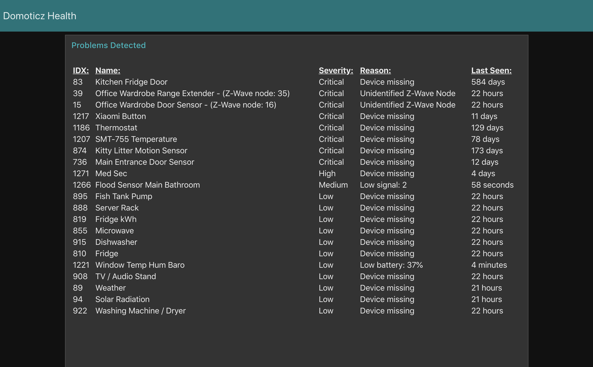

Domoticz Health Dash is an advanced home automation health checker written in Node-Red.

A web interface displays problems found throughout a home automation system using information from Domoticz.

Problems are ordered and rated by severity:

* Low
* Medium
* High
* Critical

Problem definitions include:

* Devices not seen for an extended duration (missing)
* Low battery levels
* Devices reporting a low signal
* Detect unidentified Z-Wave nodes
* Detect dead Z-Wave nodes

There are different sub severity levels within each definition, for example a battery level of 50% would show up as low severity at the bottom of the list (something to potentially keep an eye on). As the battery level continues to drop it will make its way up the list and eventually be marked as critical. Should the device fail / stop responding before it reaches critical battery, it will be picked up via the missing devices definition.

Setup instructions:

1) Install Node-Red
2) Create a Flow called "Domoticz Health"
3) Settings > "Manage palette" > Install, search for and install "node-red-dashboard"
4) Import flow into "Domoticz Health" flow
5) Double click the “Configuration” node:

Fill out the Domoticz configuration, this is also where you can whitelist devices from being tagged as missing. There are a few example whitelisted devices which you should keep unless you add your own devices.
Visit: http://ipaddress:1880/ui

The project was created out of a personal need to make sense of the huge amount of data available via Domoticz to see where problems are in the system and what needs my attention.
